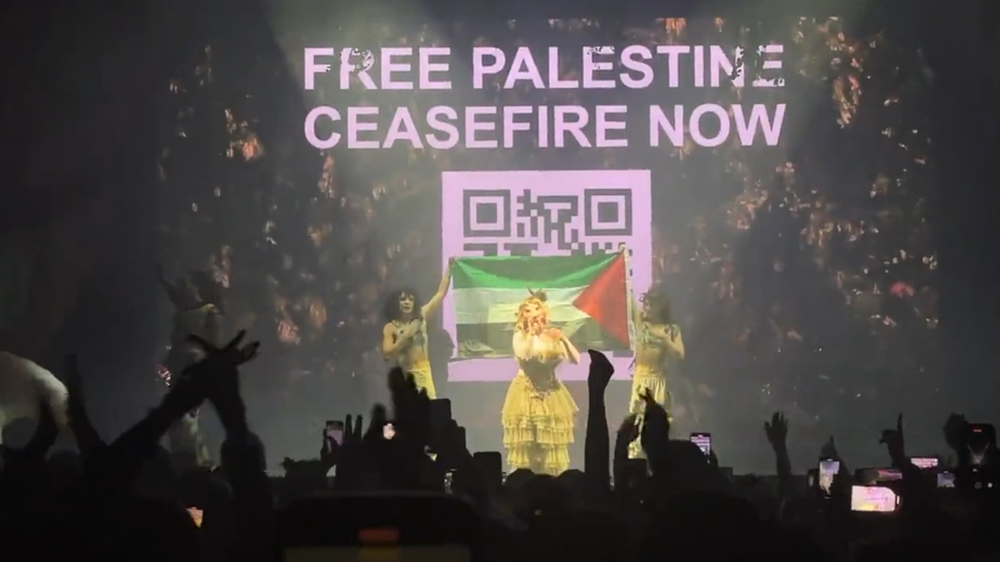

# PaliFest
by Brandon Zeidan
# Project Overview
The purpose of this project is to create a website that advertises a festival. In this case, PaliFest, a three day festival that celebrates the culture of Palestine, while also educating the masses about what's going on in Palestine. 
# Technical Overview
- Creating a rough wireframe on Figma
- Creating a rough sketch
- Using VSC (Visual Studio Code)
- Adding/fine-tuning transitions

These are what would be used to create this website for this festival
# Acknowlegements
I would like to thank the following for allow me to use these for my project:
- Figma
- Adobe Fonts
- Visual Studio Code
- GitHub*
- Safari*
- Macbook Pro*

*Despite causing me frustration and pain, these three made everything work for me. 

[Link Goes Here] (https://www.figma.com/proto/4KtZksFPLM7Ixwi1uJUmAO/PaliFest_WireFrame_Rough?node-id=4-2&node-type=canvas&t=atkuhQuRhPz4Cgrl-1&scaling=scale-down&content-scaling=fixed&page-id=0%3A1&starting-point-node-id=4%3A2)

Currently Hosted on: https://taurusgroove.github.io/ZeidanBPalifest/index.html

Images used for this project: 

